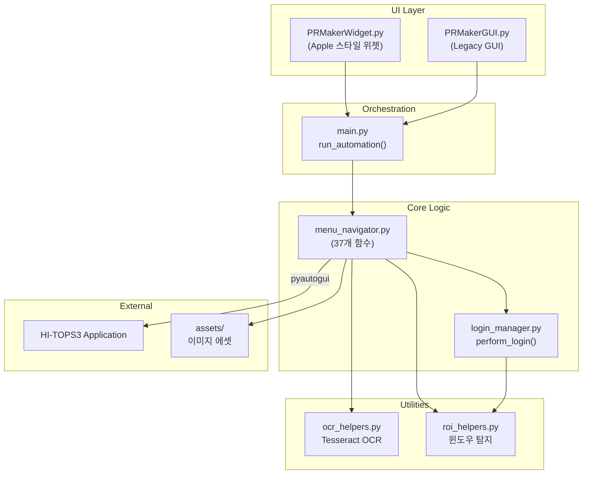
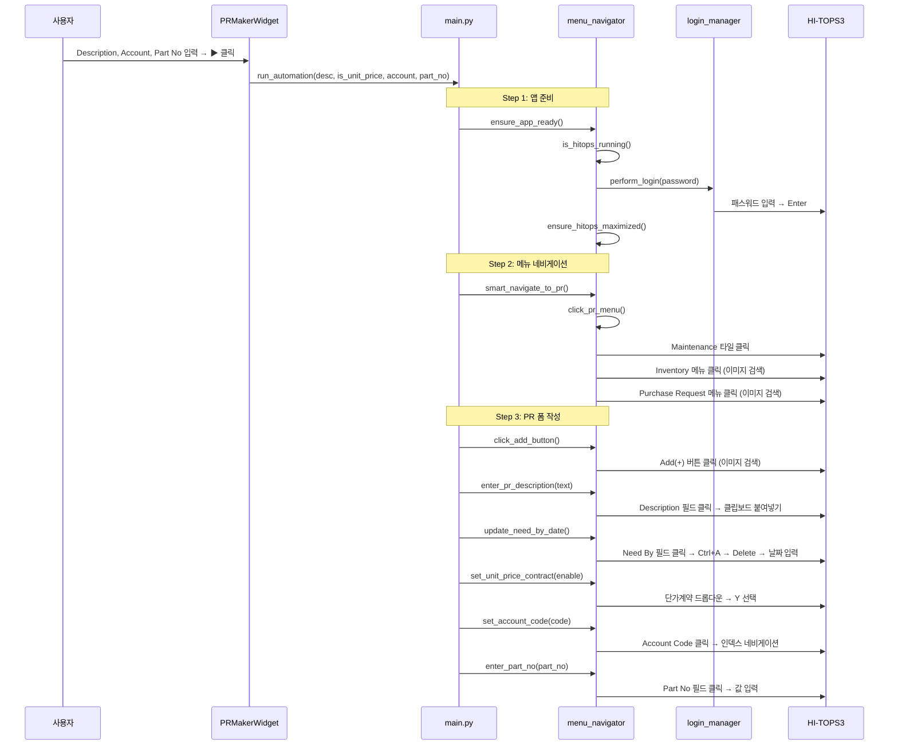
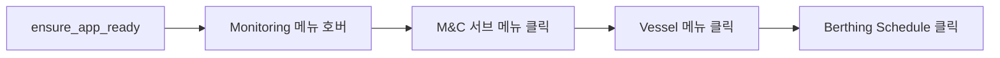

# PR Maker V1.0

> **HI-TOPS 구매요청(Purchase Request) 자동화 프로그램**
>
> HI-TOPS3 시스템에서 Purchase Request를 자동으로 생성하고, M&C / RCC 메뉴를 빠르게 탐색하는 데스크톱 자동화 위젯

---

## 📁 프로젝트 구조

```
PRMakerV1.0/
├── PRMakerWidget.py        # 메인 UI (Apple 스타일 위젯)
├── PRMakerGUI.py           # 이전 버전 UI (customtkinter)
├── main.py                 # PR 자동화 오케스트레이션
├── menu_navigator.py       # 핵심 네비게이션 & 입력 로직
├── login_manager.py        # 로그인 자동화
├── ocr_helpers.py          # OCR 유틸리티 (Tesseract)
├── roi_helpers.py          # 윈도우/영역 탐지 유틸리티
├── build.bat               # PyInstaller 빌드 스크립트
├── assets/                 # 이미지 에셋 (버튼, 라벨, 아이콘)
└── .gitignore
```

---

## 🏗️ 아키텍처



---

## 🔄 주요 Flow

### Flow 1: PR 생성 (Purchase Request Creation)

전체 자동화 순서. `main.py` → `run_automation()` 에서 제어.



#### PR 생성 단계별 상세

| 단계 | 함수 | 방식 | 에셋/입력 |
|------|------|------|-----------|
| 1. 앱 준비 | `ensure_app_ready()` | Win32 API | - |
| 2. 로그인 | `perform_login()` | 윈도우 크기 기반 판별 | `config.json` |
| 3. Maintenance 타일 | `click_pr_menu()` | 이미지 검색 | `mr_tile.png` |
| 4. Inventory 메뉴 | `click_pr_menu()` | 이미지 검색 | `inventory_menu.png` |
| 5. Purchase Request | `click_pr_menu()` | 이미지 검색 + OCR 폴백 | `purchase_request.png` |
| 6. Add 버튼 | `click_add_button()` | 이미지 검색 | `add_btn.png` |
| 7. Description | `enter_pr_description()` | 이미지 검색 + 클립보드 | `description_field.png` |
| 8. Need By | `update_need_by_date()` | 이미지 검색 + 오프셋 클릭 | `need_by_label.png` |
| 9. 단가계약 | `set_unit_price_contract()` | 이미지 검색 + 상대좌표 클릭 | `unit_price_label.png` |
| 10. Account Code | `set_account_code()` | 이미지 검색 + 인덱스 네비게이션 | `account_code_label.png` |
| 11. Part No | `enter_part_no()` | 이미지 검색 + 클립보드 | `part_no_label.png` |

---

### Flow 2: M&C 시퀀스 (Monitoring & Control)

`menu_navigator.run_mc_sequence()` 에서 제어. 위젯의 M&C 아이콘 클릭으로 실행.



| 단계 | 방식 | 비고 |
|------|------|------|
| Monitoring 호버 | OCR ("Monitoring" 텍스트 검색) | 서브메뉴 열기 위해 호버 |
| M&C 클릭 | 이미지 검색 (`mc_submenu.png`) | |
| Vessel 클릭 | `Alt+V` 단축키 → 키보드 내비게이션 | OCR 대신 키보드 방식 |
| Berthing Schedule | `Alt+V` → `B` 키 | 키보드 내비게이션 |

---

### Flow 3: RCC 메뉴

`menu_navigator.click_rcc_menu()` 에서 제어. 위젯의 RCC 아이콘 클릭으로 실행.


---

## 🔧 핵심 로직 상세

### 1. 멀티 모니터 이미지 검색 (`locate_on_all_screens`)

```python
def locate_on_all_screens(image_path, confidence_val=0.8):
    """
    PIL ImageGrab.grab(all_screens=True) 로 전체 가상 스크린을 캡처한 후,
    pyautogui.locate() 로 이미지를 찾고, 가상 스크린의 절대 좌표를 반환.
    
    핵심: 
    - 주 모니터 왼쪽에 모니터가 있으면 음수 좌표 발생 가능
    - win32api.GetSystemMetrics로 가상 스크린 원점(SM_XVIRTUALSCREEN) 보정
    """
```

**왜 이 함수가 필요한가?**
- `pyautogui.locateOnScreen()`은 주 모니터만 캡처
- HI-TOPS가 보조 모니터에 열릴 수 있으므로, 전체 가상 스크린에서 검색 필요

---

### 2. 마우스 검증 시스템 (`verify_and_execute_mouse`)

```python
def verify_and_execute_mouse(log_x, log_y, action="click", jitter=0):
    """
    1. pyautogui.moveTo(x, y) 로 마우스 이동
    2. win32api.GetCursorPos() 로 실제 위치 확인
    3. 목표와 ±5px 이내면 SUCCESS → action 실행
    4. 실패하면 win32api.SetCursorPos()로 강제 이동 후 재시도
    """
```

**왜 이 함수가 필요한가?**
- 듀얼 모니터 + DPI 스케일링 환경에서 `pyautogui.click(x, y)`가 실제로 다른 좌표를 클릭
- Win32 API를 통한 이중 확인으로 안정성 보장

---

### 3. 로그인 자동 판별 (`login_manager.perform_login`)

```
1. roi_helpers.get_hitops_window_rect() 로 PID 기반 윈도우 탐색
2. 윈도우 크기 < 1000px → 로그인 화면으로 판별
3. 로그인 화면이면: 
   - 윈도우 중앙 클릭 → Ctrl+A → 패스워드 입력 → Enter
4. 크기가 크면: 이미 로그인된 것으로 간주
5. 메인 윈도우 로드 대기 (최대 60초)
```

---

### 4. Account Code 인덱스 네비게이션 (`set_account_code`)

HI-TOPS의 Account Code 드롭다운은 직접 타이핑/붙여넣기가 불가능. 대신:

```
1. 전체 Account Code 리스트를 순서대로 저장 (35개)
2. 사용자가 선택한 코드의 인덱스 계산
3. 드롭다운 클릭 → 첫 항목 선택 → Down 키 × (인덱스) 회 → Enter
```

---

### 5. 팝업 워치독 (`popup_watchdog_loop`)

백그라운드 스레드로 실행. HI-TOPS에서 발생하는 권한 오류 팝업을 자동 닫기:

```
1. win32gui.EnumWindows()로 모든 윈도우 순회
2. 제목에 "error", "authority", "권한" 등 포함 시 감지
3. 해당 팝업에 Enter/Escape 키 전송하여 자동 닫기
4. 1초 간격으로 반복 체크
```

---

### 6. Need By 날짜 입력 (`update_need_by_date`)

Windows Date Picker 컨트롤에 날짜를 입력하는 로직:

```
1. need_by_label.png 이미지로 라벨 위치 탐색
2. 라벨 중심에서 오른쪽 +80px 오프셋으로 입력 필드 클릭
3. Ctrl+A → Delete → 기존 값 삭제
4. pyautogui.write('YYYY-MM-DD') 로 새 날짜 입력
   - 날짜 = 현재 날짜 + 1개월
```

> ⚠️ **주의**: `Ctrl+A` 후 반드시 `Delete` 키를 눌러야 기존 값이 삭제됨.
> `Delete` 없이 바로 입력하면 기존 값 뒤에 덧붙여짐.

---

## 🖼️ 이미지 에셋 목록

`assets/` 디렉토리에 저장된 UI 요소 캡처 이미지:

| 에셋 파일명 | 용도 | 사용 함수 |
|-------------|------|-----------|
| `mr_tile.png` | Maintenance & Repair 타일 | `click_pr_menu()` |
| `inventory_menu.png` | Inventory 메뉴 텍스트 | `click_pr_menu()` |
| `purchase_request.png` | Purchase Request 메뉴 | `click_pr_menu()` |
| `add_btn.png` | Add(+) 버튼 (초록색) | `click_add_button()` |
| `description_field.png` | PR Description 폼 영역 | `enter_pr_description()` |
| `need_by_label.png` | "Need By" 라벨 텍스트 | `update_need_by_date()` |
| `unit_price_label.png` | "단가계약" 라벨 텍스트 | `set_unit_price_contract()` |
| `account_code_label.png` | "Account Code" 라벨 | `set_account_code()` |
| `part_no_label.png` | "Part No." 라벨 | `enter_part_no()` |
| `mc_submenu.png` | M&C 서브메뉴 | `run_mc_sequence()` |
| `tools_icon.png` | 위젯 Tools 아이콘 | `PRMakerWidget.py` |
| `mc_icon.png` | 위젯 M&C 아이콘 | `PRMakerWidget.py` |
| `rcc_icon.png` | 위젯 RCC 아이콘 | `PRMakerWidget.py` |

> ⚠️ **중요**: 이 이미지들은 실제 HI-TOPS 화면에서 캡처한 것으로, 해상도/DPI 변경 시 다시 캡처 필요.
> Git에 원본이 보존되어 있으므로 `git checkout <commit> -- assets/` 로 복원 가능.

---

## ⌨️ 위젯 단축키

| 단축키 | 기능 |
|--------|------|
| `Ctrl + Shift + P` | 마우스 커서 위치에 위젯 표시 |
| `Escape` | 위젯 숨김 |

---

## ⚙️ 설정 파일

### `config.json` (자동 생성)

```json
{
    "password": "your_hitops_password"
}
```

위젯 설정(⚙) 에서 변경 가능.

---

## 🔨 빌드

```bash
# build.bat 실행 또는
pyinstaller PRMakerWidget.spec
```

---

## 📋 의존성

| 패키지 | 용도 |
|--------|------|
| `pyautogui` | 마우스/키보드 자동화 |
| `pyperclip` | 클립보드 (한글 입력 지원) |
| `Pillow` | 스크린 캡처, 이미지 처리 |
| `opencv-python` | 이미지 매칭 (confidence 기반) |
| `pywin32` | Win32 API (윈도우 관리) |
| `customtkinter` | 위젯 UI 프레임워크 |
| `pynput` | 글로벌 핫키 (Ctrl+Shift+P) |
| `pytesseract` | OCR (폴백용) |
| `python-dateutil` | 날짜 계산 (relativedelta) |

---

## 🐛 알려진 주의사항

1. **이미지 에셋은 DPI/해상도 의존적** — 모니터 환경이 바뀌면 에셋 재캡처 필요
2. **Account Code 드롭다운** — 직접 타이핑 불가, 인덱스 기반 键보드 내비게이션 사용
3. **Need By Date Picker** — 반드시 `Ctrl+A → Delete → 입력` 순서 준수
4. **Part No** — 3자리 이하 입력 시 HI-TOPS가 전체 DB 검색으로 크래시 위험 → 자동 스킵
5. **팝업 워치독** — 네비게이션 중 권한 오류 팝업 자동 처리 (백그라운드 스레드)
